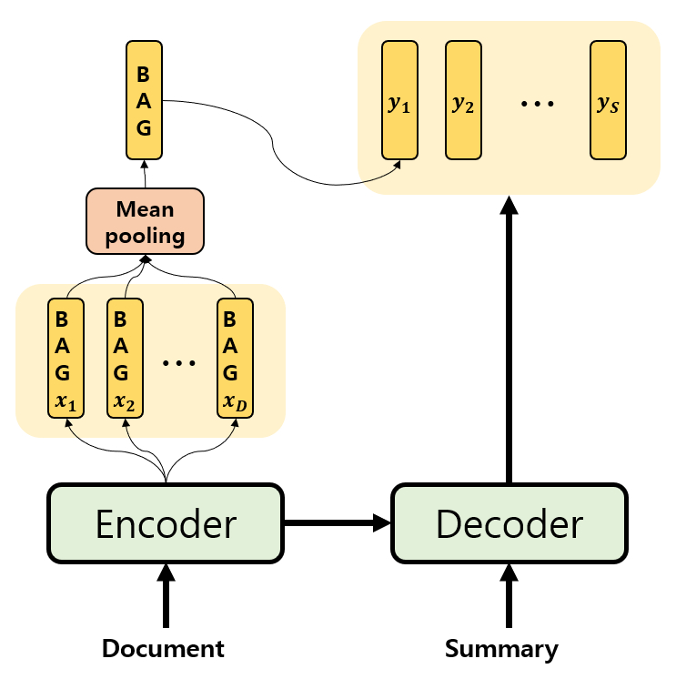

# Text Summarization Experiments

## Experiments 🥼

| Index | Info | Stability    of Code|
|:-:|:-:|:--|
|[Experiment1](https://github.com/fxnnxc/text_summarization/tree/main/experiments/experiment1)|simple vae-bart ||
|[Experiment2](https://github.com/fxnnxc/text_summarization/tree/main/experiments/experiment2)|simple beta annealing schedule   BART + beta-VAE GRU ||
|[Experiment3](https://github.com/fxnnxc/text_summarization/tree/main/experiments/experiment3)|beta annealing schedule types  BART + beta-VAE |  |
|[Experiment4](https://github.com/fxnnxc/text_summarization/tree/main/experiments/experiment4)|Freezing, Linear Probing Issue |  |
|[Mini Experiments](https://github.com/fxnnxc/text_summarization/tree/main/experiments)| Fast try!!!  |  |

---

## Result

The only successful case is
[[CNN-DM] Additional Path From Encoder and use it only for the First word with Pretrained](https://github.com/fxnnxc/text_summarization/tree/main/experiments#%EF%B8%8F-4-cnn-dmtrain-with-additional-path-from-encoder-and-use-it-only-for-the-first-word-pretrained)

|Model|ROUGE1	| ROUGE2 |	RUOGEL	| Novel 1	| Novel 12 |	Novel 13|
|:-:|:-:|:-:|:-:|:-:|:-:|:-:|
|BART|43.45 |	20.62 |	40.35 |	1.62 |	11.83 |	21.78 |
|Ours|**43.63** |	**20.81** |	40.3 |	**1.009**	 | **7.86** |	**15.32** |

You can check the [Result Sheets](https://docs.google.com/spreadsheets/d/12pEqyhzrY7bBsbuEe191Vs0DQyCQLA7EJ_YZQN82Ozo/edit#gid=1507687031)
for other results

## Update History

* 12/19 Implementated [Inference bart parallel](https://github.com/fxnnxc/text_summarization/blob/main/experiments/experiment3/inference/bart_base_inference_parallel.py)(spped up!)
* 12/20 [Experiment3-Mini2](https://github.com/fxnnxc/text_summarization/tree/main/experiments/experiment3#%EF%B8%8F-mini-experiments-%EF%B8%8F) finished(cyclic annealing) 
* 12/21 Implementated [Inference bart vae parallel](https://github.com/fxnnxc/text_summarization/blob/main/experiments/experiment3/inference/bart_vae_inference_parallel.py)(spped up!)
* 12/22 Close experiment3(There was a problem in the model) and make experiment4
* 12/23 Make Literature Review Category
* 12/24 Gathered all papers
* 12/28 Experiment4 setting 
* **2021/01/26 Close the repo**

## Literature Reviews 

* [ACL](https://2021.aclweb.org/)
* [IJCAI](https://ijcai-21.org/)
* [Text Summarization Study](https://github.com/fxnnxc/text_summarization/tree/main/study)
* [Conferences](https://github.com/fxnnxc/text_summarization/blob/main/study/conferences.md)
