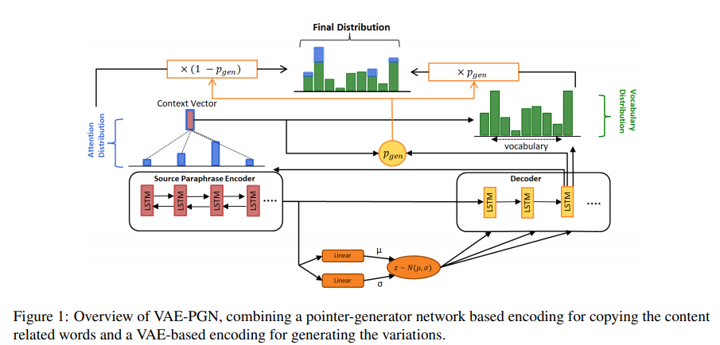

# Text Summarization

## Papers 

---

### 2020

---

## 2019

#### **On the Importance of the Kullback-Leibler Divergence Term in Variational Autoencoders for Text Generation**
* *Proceedings ofthe 3rd Workshop on Neural Generation and Translation (WNGT 2019)*

* controlling the information transmitted through the VAE channel
* the trade-off between the amount of informa- tion encoded in a latent code during training, and the generative capacity of the model.
* Sender-Receiver in a communication network
 * *R* : rate which measures the compression level of z as compared to the original message x
 * *D* : overall performance of the communication in encoding a message at sender and successfully decoding it at the receiver
 * *I(x;z)* : the capacity of the encoder channel (Mutual Information)

#### **Nucleus Sampling(NS)**
* *Holtzman et al*
* Threashold p (p=1 means sampling from the full distribution)

#### **VAE-PGN based Abstractive model in Multi-stage Archietecture for Text Summarization**
* [*Hyungtak Choi et al.*](https://www.aclweb.org/anthology/W19-8664.pdf)
* Pointer-Generator Network(PGN)
* VAE-based PGN model to overcome the extractive nature.
* Eliminate non-critical information from the source text using bertsum.

#### *BERTSUM: bert-based extractive model*
* *Liu*
* eliminate less important sentences by scoring each sentence in the source text.
---

## 2018

#### **Top-k**
* *Fan et al.,*

#### **word-level content selectino model to focuse on only critical information**
*Gehrmann et tal.*

---

## 2017

---

## 2016

#### **Vanilla VAE applied to text** 
* *Bowmman et al.*

#### **Beta VAE with annealing** 
* *Bowman et al.*

#### **Copy mechanism**
* *Gu et al. 2016*

---

## 2015

---

## 2014

#### **VAEs**
* *Kingma and Welling*

#### **Generative Adversarial Networks(GANs)**
* *Goodfellow et al.*

---

## Problems 

### **Posterior collapse**
* the inference network produces uniformative latent variables

#### **Sol1.** Modifiying the architecture of the model by weakening decoders
* *Bowman et al., 2016; Miao et al., 2015; Yang et al., 2017; Semeniuta et al., 2017;*

#### **Sol2.** Introducing additional connections between the encder and decoder to enforce the dependence between x and z
* *Zhao et al., 2017; Goyal et al., 2017; Dieng et al., 2018*

#### **Sol3.** Using more flexible or multimodal priors
* *Tomczak and Welling, 2017; Xu and Durrett, 2018*

#### **Sol4.** Alternating the training b  on the inference network in the earlier stages
* *He et al., 2019*

#### **Sol5.** Augmenting amortized optimization of VAEs with instance based optimization of stochastic variational inference
* *Kim et al., 2018; Marino et al., 2018*

#### **Sol6.** delta-VAE
* *Razavi et al., 2019*

#### **Sol7.** beta-VAE
* *Hig- gins et al., 2017*
