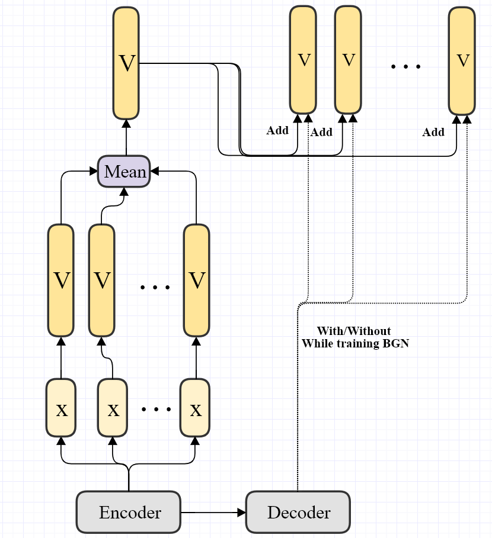

- [Experiments](#experiments)
  - [🏰 : Train freezed BART with addtional moudule](#--train-freezed-bart-with-addtional-moudule)
    - [🧙‍♂️ 1. Is learning rate important?](#️-1-is-learning-rate-important)
    - [🧙‍♂️ 2. Train with addtional path from encoder and use it only for the first word.](#️-2-train-with-addtional-path-from-encoder-and-use-it-only-for-the-first-word)

# Experiments

## 🏰 : Train freezed BART with addtional moudule
* Goal : Get higher ROUGE score with freezed bart with addtional module. 
* Rule
  * Do not test with more than 1 day. 

### 🧙‍♂️ 1. Is learning rate important?

* Token : 20210129

* Setup
  1. Model : BART + BGN(Bag of words Generator Network) from the encoder
  2. Criterion : ROUGE score
  3. Data : XSum

*  Conditions
   *  learning rate(3e-5, )
   *  training  w/wo combining the linear layer of the transformer
* Result
    * https://docs.google.com/spreadsheets/d/12pEqyhzrY7bBsbuEe191Vs0DQyCQLA7EJ_YZQN82Ozo/edit#gid=0

						
[Materials](archiveWd/20210119)
* Conclusion

### 🧙‍♂️ 2. Train with addtional path from encoder and use it only for the first word. 
* Additional module helps to predict the first word which is the most important choice. 

* Setup
  1. Model : BART + BGN from the encoder but I add it only to the first part
  2. Criterion : ROUGE score
  3. Data :  XSUM

* Conditions
  * start from pretrained verision.
  * Learning rate (3e-5)
  * Warm UP  (500)
  * Epoch  (5)

* Result
    * https://docs.google.com/spreadsheets/d/12pEqyhzrY7bBsbuEe191Vs0DQyCQLA7EJ_YZQN82Ozo/edit#gid=207935871

[Materials](archiveWd/20210119)
* Conclusion