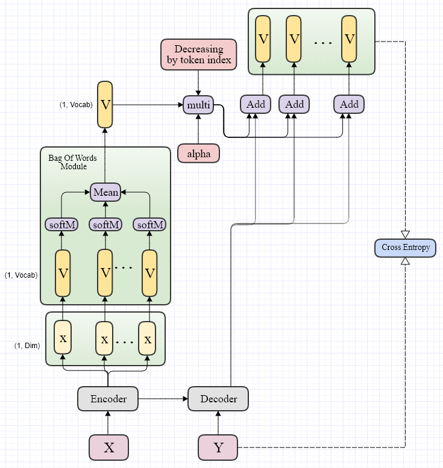

- [🏰 : Train freezed BART with addtional moudule](#--train-freezed-bart-with-addtional-moudule)
  - [👻 1. Is learning rate important?](#-1-is-learning-rate-important)
  - [👻 2. [XSum]Train with addtional path from encoder and use it only for the first word.](#-2-xsumtrain-with-addtional-path-from-encoder-and-use-it-only-for-the-first-word)
  - [👻 3. [CNN-DM]Train with additional path from encoder and use it only for the first word.](#-3-cnn-dmtrain-with-additional-path-from-encoder-and-use-it-only-for-the-first-word)
  - [🧙‍♂️ 4. [CNN-DM]Train with additional path from encoder and use it only for the first word. Pretrained!!](#️-4-cnn-dmtrain-with-additional-path-from-encoder-and-use-it-only-for-the-first-word-pretrained)
  - [💀 5. [CNN-DM] Control the relative extractive for the transformer](#-5-cnn-dm-control-the-relative-extractive-for-the-transformer)
  - [6. control the information of the encoded features in decreasing manner.](#6-control-the-information-of-the-encoded-features-in-decreasing-manner)
  - [7. Remove the chosen words](#7-remove-the-chosen-words)

[Result Table Link](https://docs.google.com/spreadsheets/d/12pEqyhzrY7bBsbuEe191Vs0DQyCQLA7EJ_YZQN82Ozo/edit#gid=207935871)


# 🏰 : Train freezed BART with addtional moudule
* Goal : Get higher ROUGE score with freezed bart with addtional module. 
* Rule
  * Do not test with more than 1 day. 

---

## 👻 1. Is learning rate important?

```TK20210129_1```

* Token : 20210129

* Setup
  1. Model : BART + BGN(Bag of words Generator Network) from the encoder
  2. Criterion : ROUGE score
  3. Data : XSum

*  Conditions
   *  learning rate(3e-5, )
   *  training  w/wo combining the linear layer of the transformer while training
* Result
    * https://docs.google.com/spreadsheets/d/12pEqyhzrY7bBsbuEe191Vs0DQyCQLA7EJ_YZQN82Ozo/edit#gid=0


						
[Materials](archiveWd/20210119)
* Conclusion

---

## 👻 2. [XSum]Train with addtional path from encoder and use it only for the first word. 

```TK20210129_2```

Additional module helps to predict the first word which is the most important choice. 

* Setup
  1. Model : BART + BGN from the encoder but I add it only to the first part
  2. Criterion : ROUGE score
  3. Data :  XSUM

* Conditions
  * start from pretrained verision.
  * Learning rate (3e-5)
  * Warm UP  (500)
  * Epoch  (5)


---

## 👻 3. [CNN-DM]Train with additional path from encoder and use it only for the first word.

```TK20210201_1```

* **Setup**
  1. Model : BART + BGN from the encoder but I add it only to the first part.
     1. Finetuned
  2. Criterion : ROUGE score
  3. Data :  CNN-DM 

* **Conditions**
  * start from finetuned verision.
  * Learning rate (3e-5)
  * Warm UP  (500)
  * Epoch  (5)
  * Freeze BART
  * 
* **Work Flow**
1. Freeze encoder and decoder to train only the PGN
2. change ```train.py``` code to save a model after 2K updates maximum 10K
3. run inference codes 


---


## 🧙‍♂️ 4. [CNN-DM]Train with additional path from encoder and use it only for the first word. Pretrained!!

```TK0202```

* **Setup**
  1. Model : BART + BGN from the encoder but I add it only to the first part
     1. Pretrained
  2. Criterion : ROUGE score
  3. Data :  CNN-DM

* **Conditions**
  * start from Pretrained verision.
  * Learning rate (3e-5)
  * Warm UP  (500)
  * Epoch  (5)
  * Freeze BART

* **Work Flow**
1. Train full model. 
2. Start from the pretrained model


[Materials](archiveWd/20210203)

**한계점**

1. 소프트하게 유니그램을 저장하는 방식. 
2. 단어페어에 대한 확률

---


## 💀 5. [CNN-DM] Control the relative extractive for the transformer

```💀 : Failed since I got OOM error```

```TK0203_1```

Train with additional path from encoder and use it only for the first word and control it with alpha

* **Setup**
  1. Model : BART + BGN from the encoder but I add it only to the first part
     1. Pretrained
  2. Criterion : ROUGE score
  3. Data :  CNN_DM

* **Conditions**
  * start from Pretrained verision.
  * Learning rate (3e-5)
  * Warm UP  (500)
  * Epoch  (5)

* **Work Flow**
  1. Archive the previos work
  2. write a source code to calculate the ROUGE score
  3. write a source code to predict the ROUGE score(alpha)
  4. multiply it to the output of BGN(bag of words network)


[Materials](archiveWd/20210203)

---


## 6. control the information of the encoded features in decreasing manner. 

Task Token : ```TK0205_1```

* **Setup**
  1. Model is BART + BGN from the encoder and use it to the last linear layer in the decreasing manner. 
  2. Criterion : ROUGE score
  3. Data : CNN-DM

* **Wrok Flow**
  - [X] Write a code. (model.py)
  - [X] Train
  - [X] Write a code. (Sequence_generator.py)
  - [X] [archive](archived/20210205) the source code 
  - [X] prepare the table of the result
  - [X] Draw a diagram and wait for the result. 



----

## 7. Remove the chosen words

Task Token : ```TK0208_1```

**Setup**
  1. Model is BART + BGN from the encoder and use it to the last linear layer in the decreasing manner. 
  2. Criterion : ROUGE score
  3. Data : CNN-DM

**Wrok Flow**
- [ ] Write a code. (model.py)
- [ ] Train
- [ ] Write a code. (Sequence_generator.py)
- [ ] [archive](archived/20210208) the source code 
- [ ] prepare the table of the result
- [ ] Draw a diagram and wait for the result. 

---
