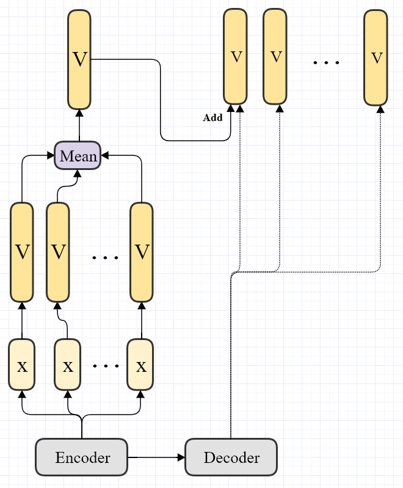

- [Experiments](#experiments)
  - [🏰 : Train freezed BART with addtional moudule](#--train-freezed-bart-with-addtional-moudule)
    - [🧙‍♂️ 1. Is learning rate important?](#️-1-is-learning-rate-important)
    - [🧙‍♂️ 2. [XSum]Train with addtional path from encoder and use it only for the first word.](#️-2-xsumtrain-with-addtional-path-from-encoder-and-use-it-only-for-the-first-word)
    - [🧙‍♂️ 3. [CNN-DM]Train with additional path from encoder and use it only for the first word.](#️-3-cnn-dmtrain-with-additional-path-from-encoder-and-use-it-only-for-the-first-word)
    - [🧙‍♂️ 4. [CNN-DM]Train with additional path from encoder and use it only for the first word. Pretrained!!](#️-4-cnn-dmtrain-with-additional-path-from-encoder-and-use-it-only-for-the-first-word-pretrained)


# Experiments

## 🏰 : Train freezed BART with addtional moudule
* Goal : Get higher ROUGE score with freezed bart with addtional module. 
* Rule
  * Do not test with more than 1 day. 

### 🧙‍♂️ 1. Is learning rate important?

```TK20210129_1```

* Token : 20210129

* Setup
  1. Model : BART + BGN(Bag of words Generator Network) from the encoder
  2. Criterion : ROUGE score
  3. Data : XSum

*  Conditions
   *  learning rate(3e-5, )
   *  training  w/wo combining the linear layer of the transformer while training
* Result
    * https://docs.google.com/spreadsheets/d/12pEqyhzrY7bBsbuEe191Vs0DQyCQLA7EJ_YZQN82Ozo/edit#gid=0


						
[Materials](archiveWd/20210119)
* Conclusion

---

### 🧙‍♂️ 2. [XSum]Train with addtional path from encoder and use it only for the first word. 

```TK20210129_2```

Additional module helps to predict the first word which is the most important choice. 

* Setup
  1. Model : BART + BGN from the encoder but I add it only to the first part
  2. Criterion : ROUGE score
  3. Data :  XSUM

* Conditions
  * start from pretrained verision.
  * Learning rate (3e-5)
  * Warm UP  (500)
  * Epoch  (5)




* Result
    * https://docs.google.com/spreadsheets/d/12pEqyhzrY7bBsbuEe191Vs0DQyCQLA7EJ_YZQN82Ozo/edit#gid=207935871

---

### 🧙‍♂️ 3. [CNN-DM]Train with additional path from encoder and use it only for the first word.

```TK20210201_1```

* **Setup**
  1. Model : BART + BGN from the encoder but I add it only to the first part.
     1. Finetuned
  2. Criterion : ROUGE score
  3. Data :  CNN-DM 

* **Conditions**
  * start from finetuned verision.
  * Learning rate (3e-5)
  * Warm UP  (500)
  * Epoch  (5)
  * Freeze BART
  * 
* **Work Flow**
1. Freeze encoder and decoder to train only the PGN
2. change ```train.py``` code to save a model after 2K updates maximum 10K
3. run inference codes 


### 🧙‍♂️ 4. [CNN-DM]Train with additional path from encoder and use it only for the first word. Pretrained!!

```TK0202```

* **Setup**
  1. Model : BART + BGN from the encoder but I add it only to the first part
     1. Pretrained
  2. Criterion : ROUGE score
  3. Data :  CNN-DM

* **Conditions**
  * start from Pretrained verision.
  * Learning rate (3e-5)
  * Warm UP  (500)
  * Epoch  (5)
  * Freeze BART

* **Work Flow**
1. Train full model. 
2. Start from the pretrained model


