# Experiment 2 (Text Summarization T-CVAE Annealing Schedule) 👨‍💻

This experiment is finding best KL-annealing strategy to outperform BART base model. 

> Start Date : 2020.12.16

> Finish Date : 2020.12.19

# Results
1. **KL-Term is ill-implemented cause we can not see the annealing**
   1. I added KL-Loss to cross-entropy loss which is not reduced to the token size. 

      for example, the final distribution is {4(batch), **768(token)** ,50120} --> (4, **768**)
       
      so it depends on the length of the sample. 
      
      if it has long token size, then the loss is high while KL-term isn't.

2. **Inference step is hard to code.** 
   1. This architecture didn't match BART but I trained it with BART class.
   2. Inference procedure of VAE-BART is same with the procedure of BART but different code style, **so it is not a good way of coding**

# Conclusion
1. I should find a better way to extend fairseq code(how to define model class which supports a pretrained model) 
2. KL-Term is too mimic as mentioned in Result-1. I should find a right way of gradient descent.
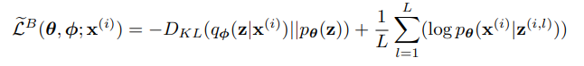

---

# Source code

> You can use it **with modification** in the original fairseq code.  

|script|info|
|:--|:-:|
|bart_vae_annealing.py|model1 concat|
|bart_vae_annealing2.py|model2 add|
|annealing_loss.py| annealing strategy KLD loss|
|train.py|Don't need it in here actually|
|train_bart.py|baseline bart + vae part|

#Results

|number|Model|Structure|Total_Updates|Annealing_M|Annealing_R|ROUGE1|ROUGE2|ROUGEL|
|:-:  |:-:  |---      |:-:|:-:|:-:|:-:|:-:|:-:|
|V0|BART|-|29400|-|-| 0.26|0.057 | 0.17|
|V1|BART_VAE|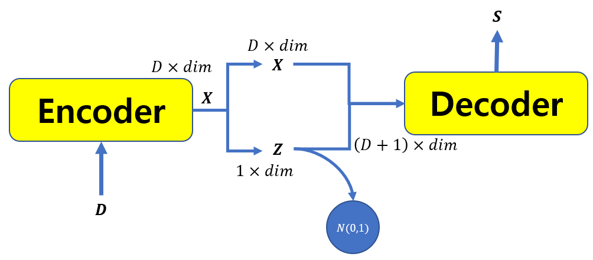|29400| 2| 0.5|❌|❌|❌|
|V2|BART_VAE||29400| 4| 0.5|❌|❌|❌|
|V3|BART_VAE||29400| 8| 0.5|❌|❌|❌|
|V4|BART_VAE||29400| Const.| Const.|❌|❌|❌|
|V5|BART_VAE|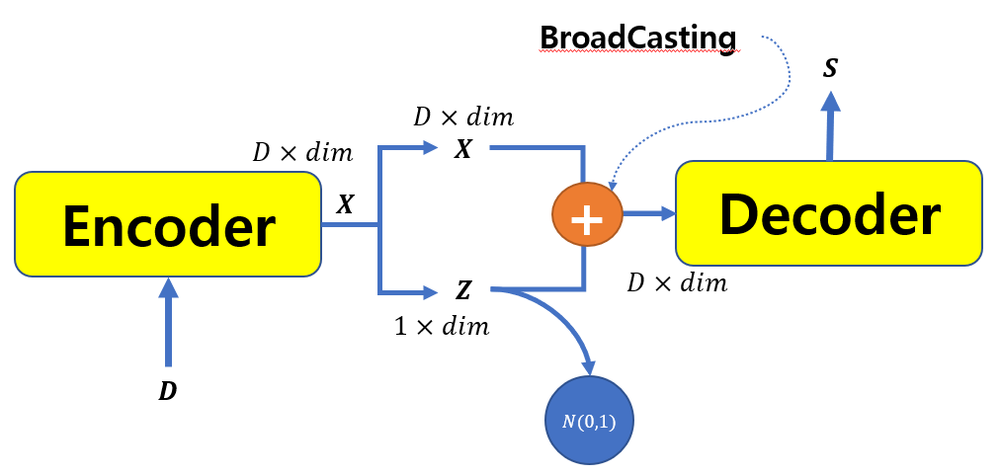|29400|2|0.5|❌|❌|❌|
|V6|BART_VAE||29400|4|0.5|❌|❌|❌|
|V7|BART_VAE||29400| 8|0.5|❌|❌|❌|

## Learning Curves

|Overlap|
|---|
|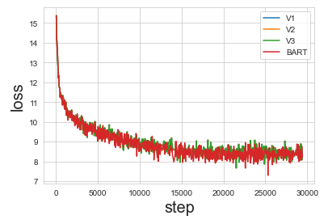|

|Model|ELBO|Reconstruction Error |KL term|
|---|---|---|---|
|0|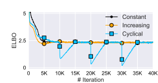|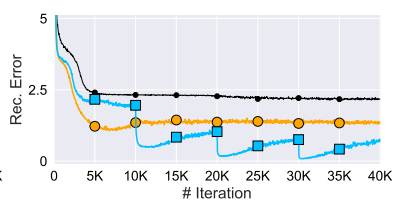|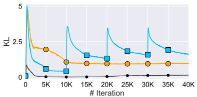|
|BART|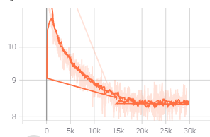|-|-|
|V_all|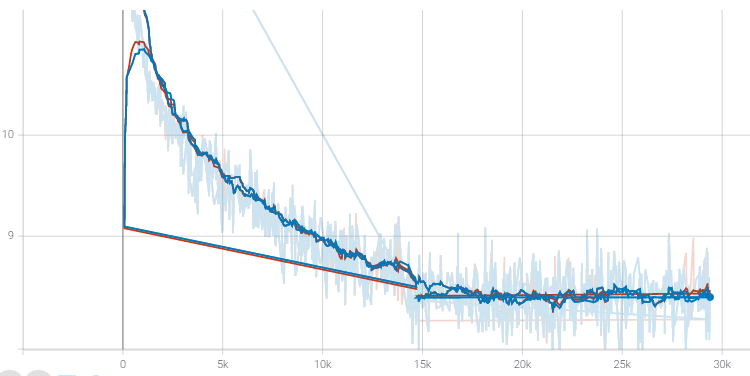|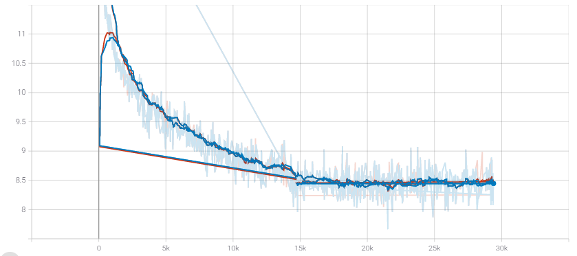|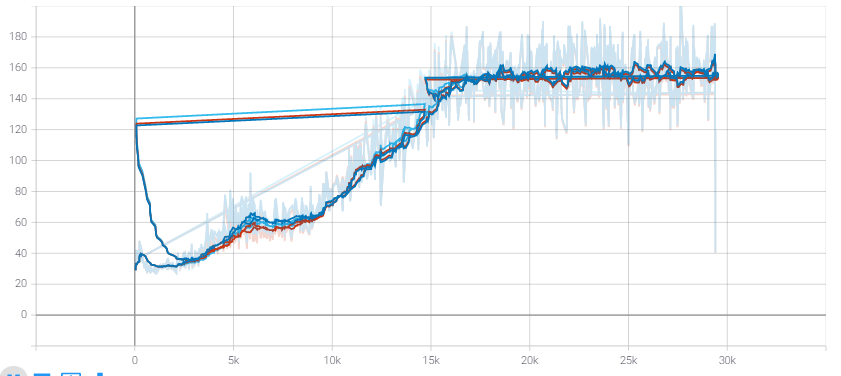|
|V1|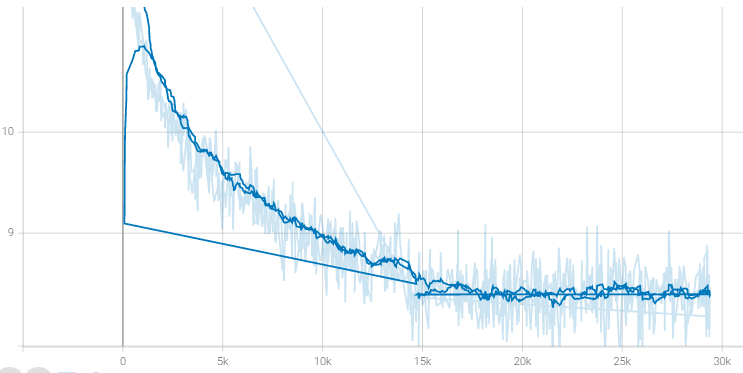|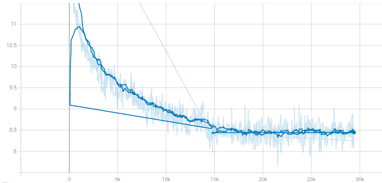|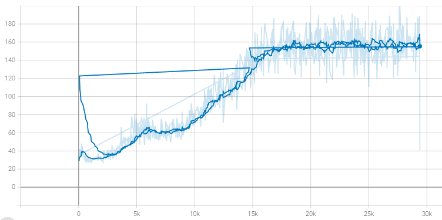|
|V2|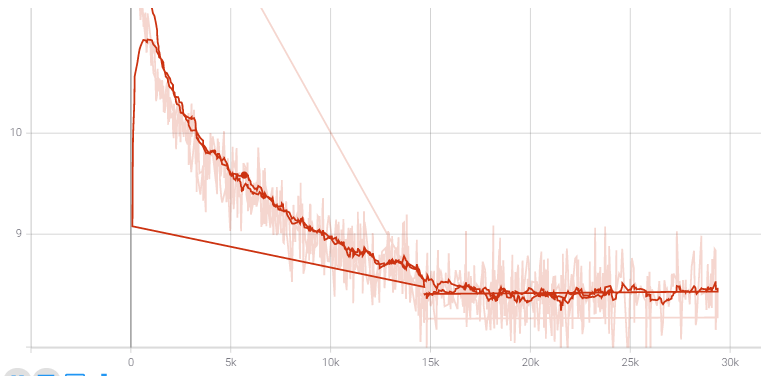||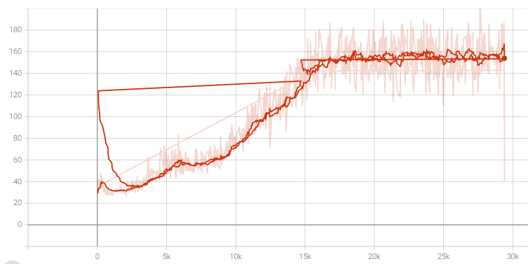|
|V3|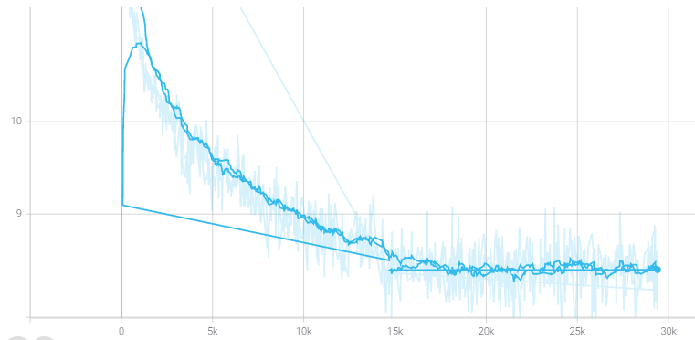|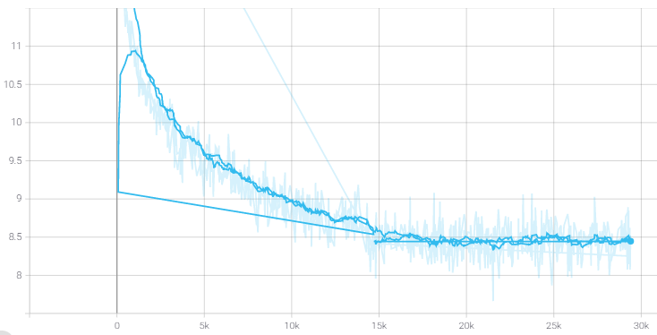|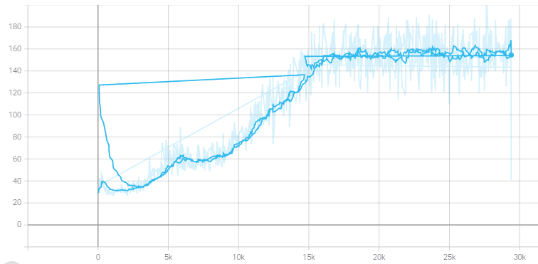|
|V5|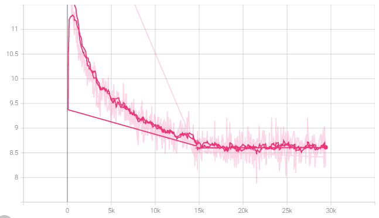|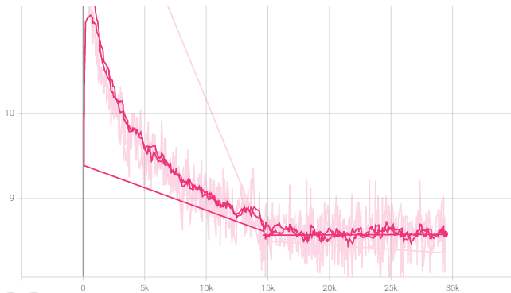|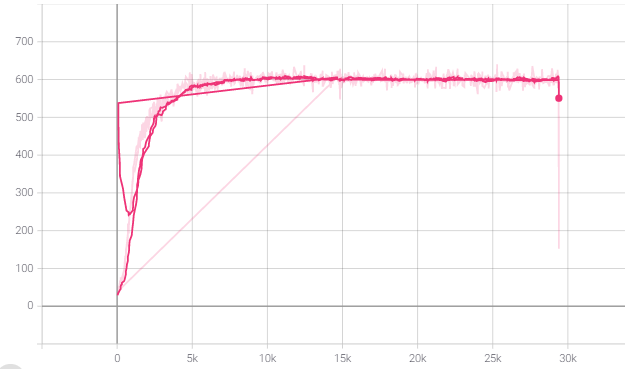|
|V6|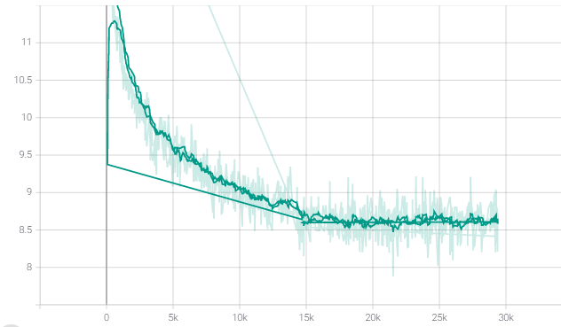|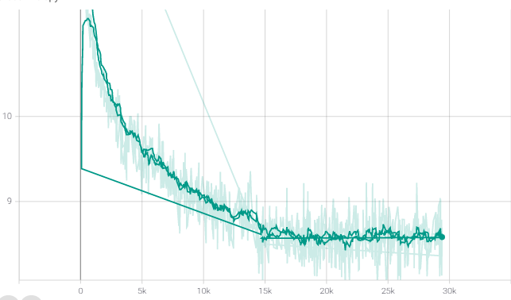|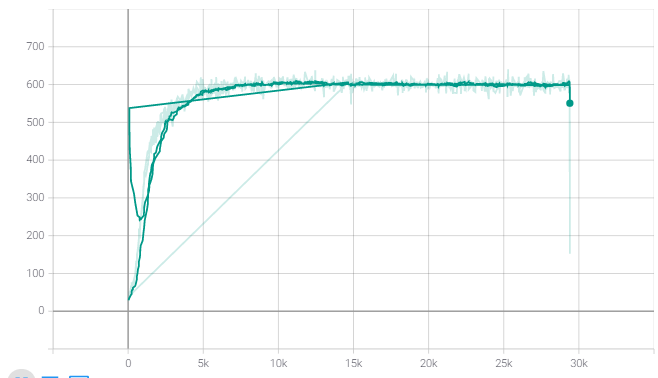|

##  Data

CNN-Daily Mail

    Train Size: 287227
    Test  Size: 11490
