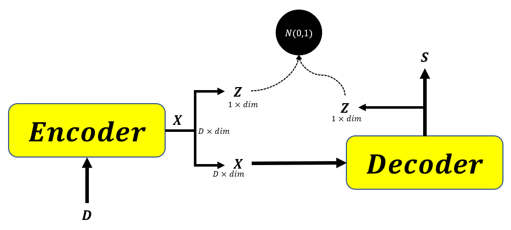
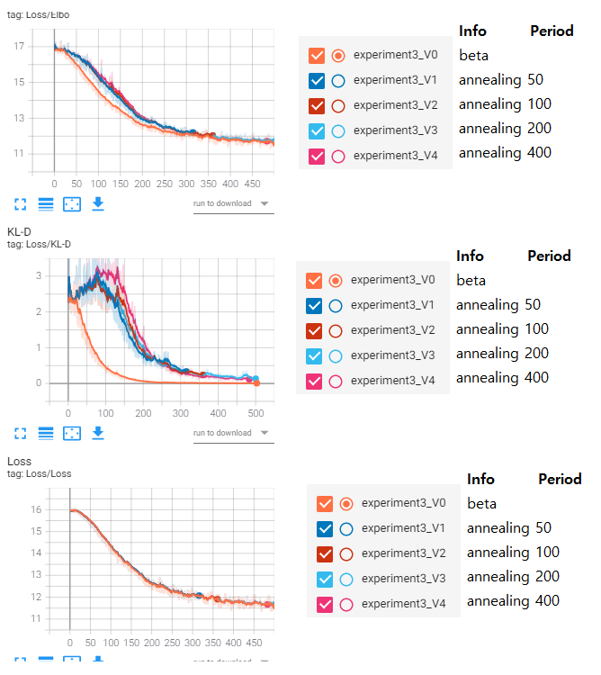

<p align="center">
  <a href="https://github.com/pytorch/fairseq"></a> 
  </a> 
</p>


# Text Summarization Using Latent Space in Transformer (experiment3)

A similar experiment with [experiment2](https://github.com/fxnnxc/text_summarization/tree/main/experiments/experiment2) but more stable code.

Now the experimental codes extend fairseq and I found a better way to build a class which is suitable **to use pretrained model**(Nice!).

> Start Date : 2020.12.19

> Finish Date : 👨‍💻

# Goal
Get higher ROUGE score than the rouge-score of original bart using latent space in the transformer.

# Models
|index|Structure|info|
|---|---|---|
|1||x = source <br/> x =encoder(x) <br/> z1 = GRU(x) <br/> x = decoder(x)  <br/>z2 = GRU(x) |


# Experiment

This experiment used bart_base model, not bart_large. 
because I thought model architecture is more important than model performance itself.  

|Model|Rouge Score(R1,R2,RL)|epoch|
|:-:|:-:|:-:|
|bart-base|0.296 0.073 0.186|8|
|model1|-|


# Source Code

> You can use it **without modification** in the original fairseq code.  


|cat|script|info|
|:-:|:--|:-:|
|criterions|kld_loss.py|KL-Divergence loss is defined|
|models|vae_bart.py|model class|
|models|hub_interface.py|for sampling. it is sample with BART hub-interface|

# 🛩️ Mini Experiments 🛩️

Additional Mini Experiments

## [Mini 1] KL annealing for additive latent variable z

|Loss with/without annealing|
|:-:|
||

* The KL-D doesn't diverge even with beta 0. It looks stable.  
* The model architecture is additive xz=a\*x +(1-a)\*z

## [Mini 2] KL annealing with different cycle
|beta|KLD|
|---|---|
||Orange |
||BLUE |
||RED |
||**SkyBlue** |
|||
|||


# Train / Inference shell

### Train
```bash
TOTAL_NUM_UPDATES=20000 
WARMUP_UPDATES=500      
LR=3e-05
MAX_TOKENS=2048
UPDATE_FREQ=4
BART_PATH=checkpoints/bart.base/model.pt
CHECKPOINT_SUFFIX=experiment3_V4
ARCH=vae_bart_base
SAVE_INTERVAL=3
MAX_EPOCH=3

CUDA_VISIBLE_DEVICES=0 python train.py data/cnn_dm-base-bin \
    --user-dir examples/vae_bart/vae_bart_src2 \
    --arch $ARCH \
    --pretrained \
    --pretrained-checkpoint $BART_PATH \
    --max-tokens $MAX_TOKENS \
    --task text_summarization_annealing \
    --source-lang source --target-lang target \
    --truncate-source \
    --layernorm-embedding \
    --share-all-embeddings \
    --share-decoder-input-output-embed \
    --reset-optimizer --reset-dataloader --reset-meters \
    --required-batch-size-multiple 1 \
    --criterion kld_loss \
    --label-smoothing 0.1 \
    --dropout 0.1 --attention-dropout 0.1 \
    --fp16 \
    --lr-scheduler polynomial_decay --lr $LR --total-num-update $TOTAL_NUM_UPDATES --warmup-updates $WARMUP_UPDATES \
    --weight-decay 0.01 --optimizer adam --adam-betas "(0.9, 0.999)" --adam-eps 1e-08 \
    --clip-norm 0.1 \
    --update-freq $UPDATE_FREQ \
    --skip-invalid-size-inputs-valid-test \
    --find-unused-parameters \
    --save-interval $SAVE_INTERVAL \
    --checkpoint-suffix $CHECKPOINT_SUFFIX \
    --max-epoch $MAX_EPOCH ;

```
