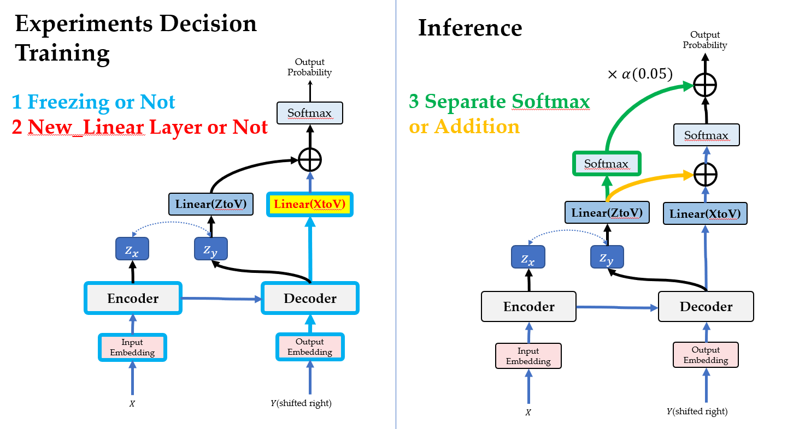
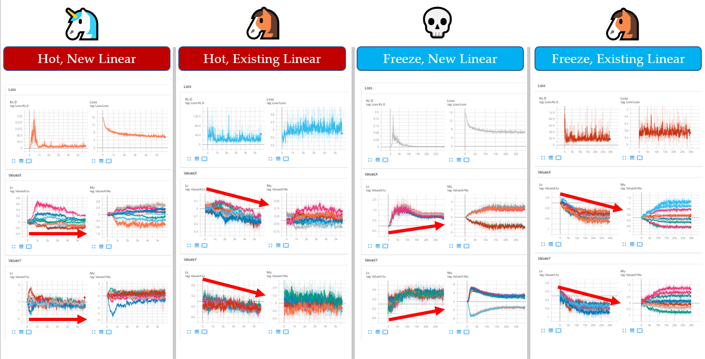

- [Experiment 4](#experiment-4)
  - [Goal:Train the transformer with additional module](#goaltrain-the-transformer-with-additional-module)
  - [Model:with Latent Generator Network](#modelwith-latent-generator-network)
  - [Loss:comparison with 4 diff training design of BART](#losscomparison-with-4-diff-training-design-of-bart)
# Experiment 4 

## Goal:Train the transformer with additional module
- [X] Minimize the impact of the latent variable 
- [] Additional module to the transformer architecture to improve the summarization quality 
- [X] Change the sequence generator code to apply additional module when inference. 

* Model
  * BART-LARGE
* Data
  * Xsum-Large
* Link
  * Powerpoint : https://drive.google.com/file/d/1lRoXy57KbOIXkRz5uvWEsYdNmJD0p4Rd/view?usp=sharing
  * Experiment Scores : https://docs.google.com/spreadsheets/d/1dY-QAsLn8clW0hCyvym-xwqPmH88LtoTvpMY7er0iBM/edit?usp=sharing

## Model:with Latent Generator Network

* Here the model use latent variable simply to get the probability in vocabulary 

## Loss:comparison with 4 diff training design of BART
