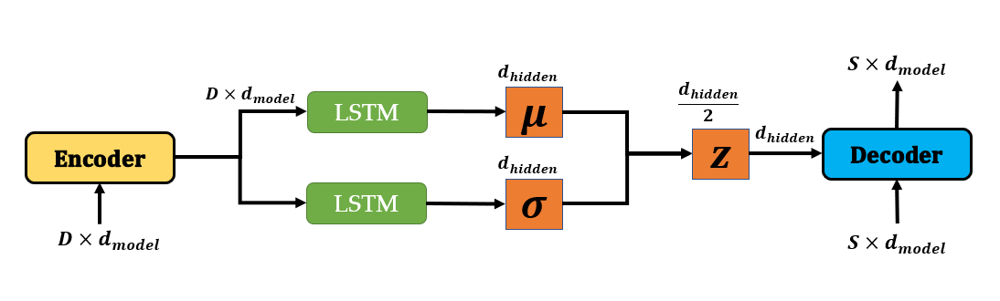
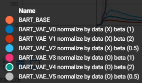
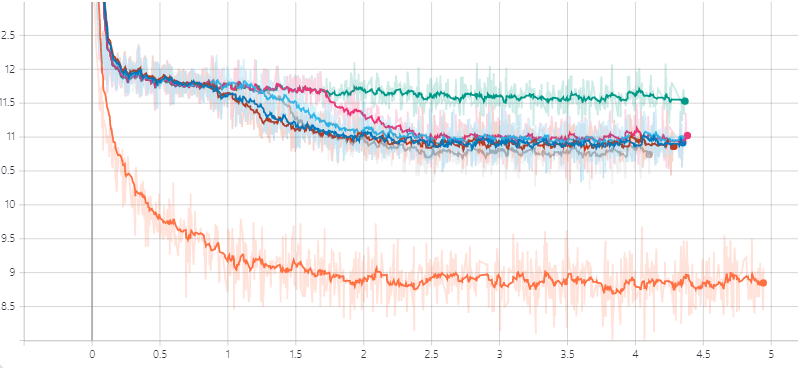
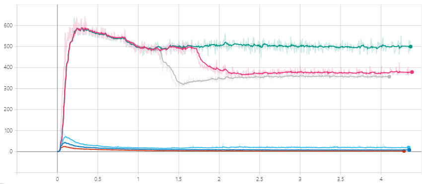

# Experiment 1

> Date : 2020.12.10

This experiment shows the train loss of **BART** and **BART_VAE_LSTM**. I tested with normalized KLD by the size of data and without it. 

BART is bart base whose hidden dimesion size is **768**(compared to 1024 of bart_large)

|Model Architecture| Hyper-parameter|
|---|---|
|||
|Cross Entropy Loss|KL-Divergence|
|||

# Result 

With this architecture we can not reduce the cross entropy loss efficiently. 
In the next architecture, I will try infer y from both x, y
