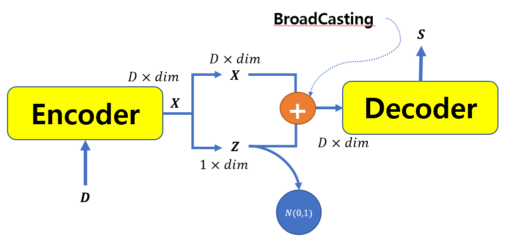
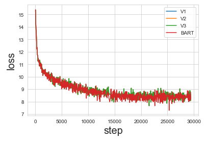
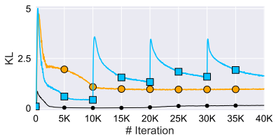
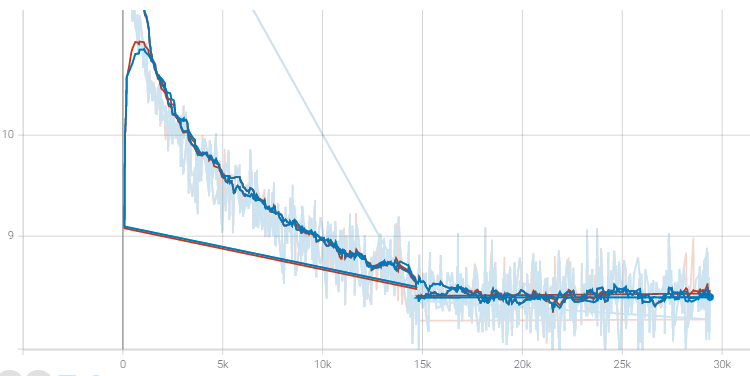
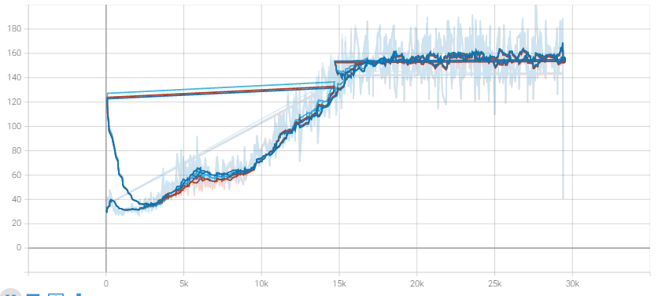
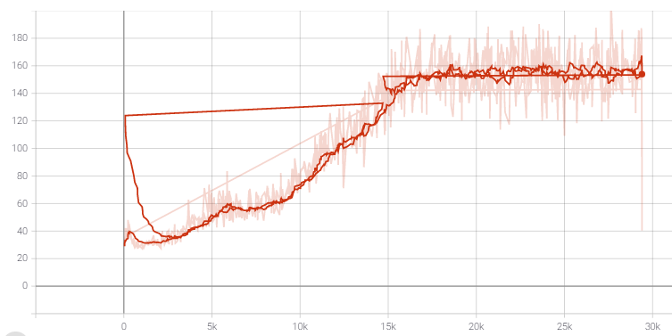
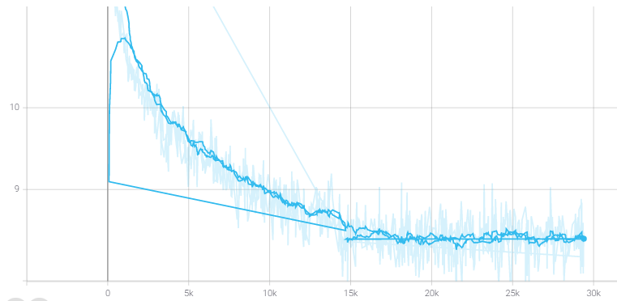
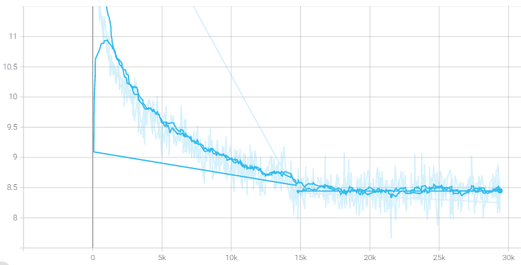

# Experiment 2 (Text Summarization T-CVAE Annealing Schedule)

> Start Date : 2020.12.16

> Finish Data : 👨‍💻

This experiment is finding best KL-annealing strategy to outperform BART base model. 

# Source code

## Model
|script|info|
|:-:|:-:|
|bart_vae_annealing.py|model1 concat|
|bart_vae_annealing2.py|model2 add|

#Results

|number|Model|Structure|Total_Updates|Annealing_M|Annealing_R|ROUGE1|ROUGE2|ROUGEL|
|:-:  |:-:  |---      |:-:|:-:|:-:|:-:|:-:|:-:|
|-|BART|-|29400|-|-| ❌|❌ | ❌|
|V1|BART_VAE||29400| 2| 0.5|❌|❌|❌|
|V2|BART_VAE||29400| 4| 0.5|❌|❌|❌|
|V3|BART_VAE||29400| 8| 0.5|❌|❌|❌|
|V4|BART_VAE||29400| Const.| Const.|❌|❌|❌|
|V5|BART_VAE||29400|2|0.5|❌|❌|❌|
|V6|BART_VAE||29400|4|0.5|❌|❌|❌|
|V7|BART_VAE||29400| 8|0.5|❌|❌|❌|

## Learning Curves

|Overlap|
|---|
||

|Model|ELBO|Reconstruction Error |KL term|
|---|---|---|---|
|0||||
|BART||-|-|
|V_all||||
|V1||||
|V2||||
|V3||||

##  Data

CNN-Daily Mail

    Train Size: 287227
    Test  Size: 11490
