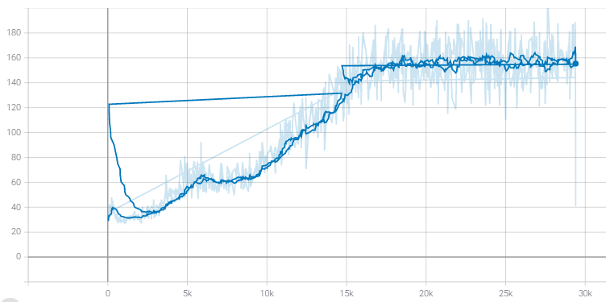

# Experiment 2

> Start Date : 2020.12.16
> Finish Data : 

This experiment is finding best KL-annealing strategy to outperform BART base model. 

|number|Model|Structure|Total_Updates|Annealing_M|Annealing_R|ROUGE1|ROUGE2|ROUGEL|
|---   |:-:  |---      |:-:|:-:|:-:|:-:|:-:|:-:|
|-|BART|-|-|-|-| ❌|❌ | ❌|
|V1|BART_VAE||29400| 2| 0.5|❌|❌|❌|
|V2|BART_VAE||29400| 4| 0.5|❌|❌|❌|
|V3|BART_VAE||29400| 8| 0.5|❌|❌|❌|
|V4|BART_VAE||29400| Const.| Const.|❌|❌|❌|

## Learning Curves
|number|ELBO|Reconstruction Error |KL term|
|---|---|---|---|
|0||||

##  Data

CNN-Daily Mail

    Train Size: 287227
    Test  Size: 11490
