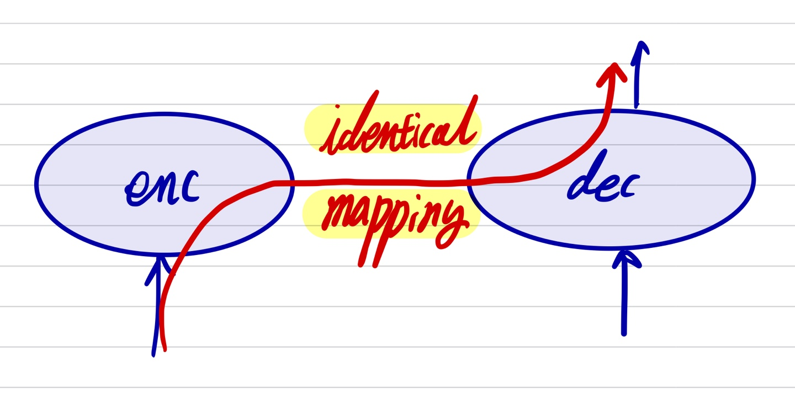

# Text Summarization

# Items

* Point Generator Network
* VAE
* Transformer

---

# Ideas 
1. In the transformer, there may be identical mapping from encoder to decoder cause we do cross attention with encoded document and decoder elements.

---

## Papers 

|**2020**|
|---|

|**2019**|
|---|

### [1][VAE]On the Importance of the Kullback-Leibler Divergence Term in Variational Autoencoders for Text Generation
* WNGT 2019
  
### [2][VAE]VAE-PGN based Abstractive model in Multi-stage Archietecture for Text Summarization**

### [3][VAE]Cyclic annealing schedule

### [4]**Nucleus Sampling(NS)**
* *Holtzman et al*
* Threashold p (p=1 means sampling from the full distribution)

### [5] **BERTSUM: bert-based extractive model**
* *Liu*
* eliminate less important sentences by scoring each sentence in the source text.

|**2018**|
|---|

### [1][VAE][Semi-Amortized-Variational-Autoencoders](#..)

### **Top-k**
* *Fan et al.,*

### **word-level content selectino model to focuse on only critical information**
*Gehrmann et tal.*

|**2017**|
|---|

### [1][PGN]Get To The Point: Summarization with Pointer-Generator Networks

### [2] Toward Controlled Generation of Text

|**2016**|
|---|

### **Vanilla VAE applied to text** 
* *Bowmman et al.*

### **Beta VAE with annealing** 
* *Bowman et al.*
* gradually increase the beta term while training.

### **Copy mechanism**
* *Gu et al. 2016*

|**2015**|
|---|

|**2014**|
|---|

### **VAEs**
* *Kingma and Welling*

### **Generative Adversarial Networks(GANs)**
* *Goodfellow et al.*

---

# Problems 

### **Posterior collapse**
* the inference network produces uniformative latent variables

#### **Sol1.** Modifiying the architecture of the model by weakening decoders
* *Bowman et al., 2016; Miao et al., 2015; Yang et al., 2017; Semeniuta et al., 2017;*

#### **Sol2.** Introducing additional connections between the encder and decoder to enforce the dependence between x and z
* *Zhao et al., 2017; Goyal et al., 2017; Dieng et al., 2018*

#### **Sol3.** Using more flexible or multimodal priors
* *Tomczak and Welling, 2017; Xu and Durrett, 2018*

#### **Sol4.** Alternating the training b  on the inference network in the earlier stages
* *He et al., 2019*

#### **Sol5.** Augmenting amortized optimization of VAEs with instance based optimization of stochastic variational inference
* *Kim et al., 2018; Marino et al., 2018*

#### **Sol6.** delta-VAE
* *Razavi et al., 2019*

#### **Sol7.** beta-VAE
* *Hig- gins et al., 2017*
