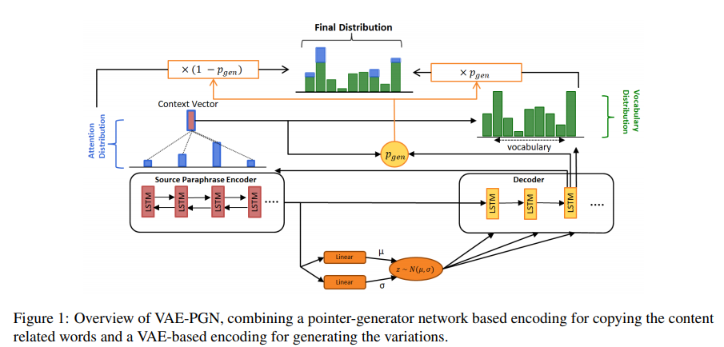

# VAE-PGN based Abstractive model in Multi-stage Archietecture for Text Summarization

* [*Hyungtak Choi et al.*](https://www.aclweb.org/anthology/W19-8664.pdf)
* Pointer-Generator Network(PGN)
* VAE-based PGN model to overcome the extractive nature. Eliminate non-critical information from the source text using bertsum.

